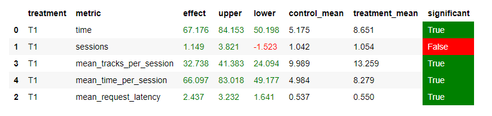

# Отчет по домашнему заданию №1
### Идея
Давайте разобьем прослушиваемые в сессию треки на группы и будем рекомендовать
треки по-своему в рамках каждой группы: рекомендуем треки по первому треку из 
каждой группы. Как разделить на группы: в одной группе примерно 7 треков 
(+-20 минут реального времени), за такое время пользователь послушал то, что 
хотел в первом треке и скорее всего захотел послушать что-то еще. В чем смысл:
так будем подбирать рекомендации именно к треку пользователя, а не к подобранным
нами трекам.

### Реализация
В рекоммендере будем хранить дополнительно две мапы: пользователь в количество
прослушанных треков в текущей группе, пользователь в первую песню в группе.
Рекомендации для пользователя подбираем к песне, которая лежит во второй мапе.
Когда в количество треков превысило 7 и последний трек был прослушан полностью
(время > 0.9 длительности трека (это дает некоторую уверенность, что новый
стартовый трек в группе в любом случае нравится пользователю и по нему можно
подбирать рекомендации)), обновляем счетчик (записываем в мапу 1). В качестве
фолбэка использовал Contextual рекоммендер, так как именно его наша цель
превзойти.

### Код
Код в файле custom.py в botify, немного изменений в server.py и experiment.py
(завел эксперимент и заваерил свой рекоммендер)

### Запуск
Стандартная конфигурация: python sim/run.py --episodes 1000 --config config/env.yml single --recommender remote

### Итог

Улучшение целевой метрики на 66%